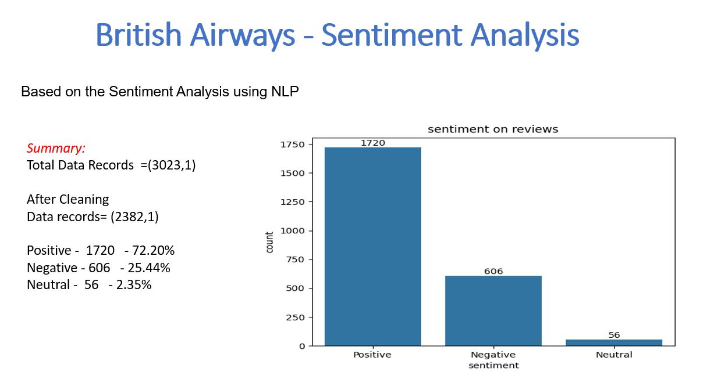
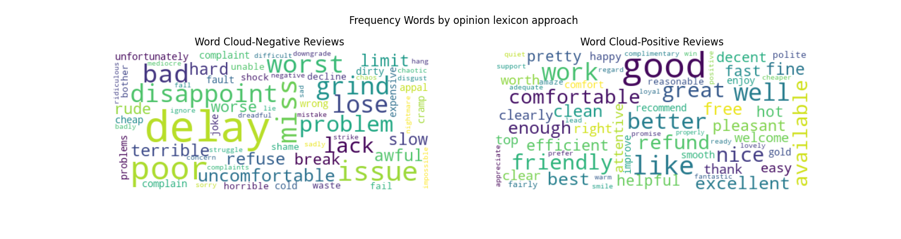
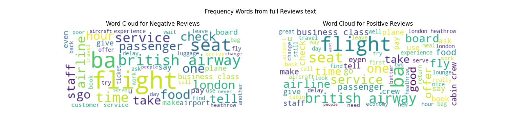

## ***British Airways Data***
In this project, Sentiment Analysis is performed on customer reviews and feedback from British Airways. 
The objective is to determine the sentiment of each review (Positive, Negative, Neutral) and extract meaningful insights from customer experiences.

#### 🔍 Data : 
Records: 3023  
After Cleaning (removed NA): 2382

### ⚙️ Preprocessing steps
- Converted text to lowercase  
- Removed stopwords and punctuation  
- Lemmatized the text to its base form  
- Determined Sentiment Polarity for each review  
- Classified the reviews as Positive, Negative, or Neutral 

## **Summary**
Here is a summary of the sentiment analysis for the British Airways data:

## Word Cloud 
created WordCloud for Positive and Negative words using **Opinion Lexicon approach**

created WordCloud for Positive and Negative words using **full Reviews text**

